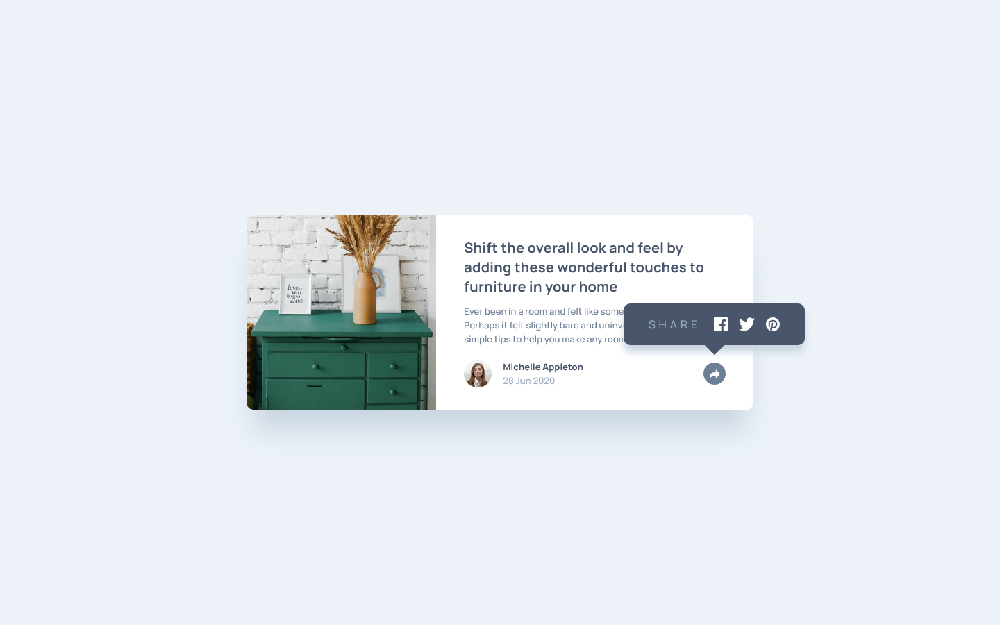

# Frontend Mentor - Article preview component solution

This is a solution to the [Article preview component challenge on Frontend Mentor](https://www.frontendmentor.io/challenges/article-preview-component-dYBN_pYFT). Frontend Mentor challenges help you improve your coding skills by building realistic projects.

## Table of contents

- [Overview](#overview)
  - [The challenge](#the-challenge)
  - [Screenshot](#screenshot)
  - [Links](#links)
- [My process](#my-process)
  - [Built with](#built-with)
  - [What I learned](#what-i-learned)
  - [Useful resources](#useful-resources)
- [Author](#author)
- [Acknowledgments](#acknowledgments)

## Overview

### The challenge

Users should be able to:

- View the optimal layout for the component depending on their device's screen size
- See the social media share links when they click the share icon

### Screenshot

### Links

- Solution URL: [Add solution URL here](https://your-solution-url.com)
- Live Site URL: [Add live site URL here](https://your-live-site-url.com)

## My process

### Built with

- Semantic HTML5 markup
- Flexbox
- CSS Grid
- Mobile-first workflow
- [Svelte][svelteweb]
- [Tailwind CSS][tailwinddocs]
- [melt-ui][meltuidocs]

### What I learned

I struggled a bit with centerting elements within the mobile overlay for the share functionality of this challenge. I played with the padding of the main content footer of the card and the share overlay and finally was able to find the solution.

### Useful resources

- [melt-ui docs][meltuidocs]
- [Svelte Docs][svelteweb]
- [Tailwind CSS Docs][tailwinddocs]

## Author

- Website - [JYLN](https://jyln.dev)
- Frontend Mentor - [@JYLN](https://www.frontendmentor.io/profile/JYLN)

[meltuidocs]: https://www.melt-ui.com/docs/introduction
[tailwinddocs]: https://tailwindcss.com/docs
[svelteweb]: https://svelte.dev/
